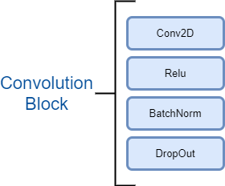

## Twin Delayed DDPG - Reinforcement Learning

### Goal
Autonomous car simulation on kivy environment using TD3 where the cab picks the passenger from the pickup point and drops to the marked location.  

**Conditions:**
- Use TD3
- Use cropped image out of the map as a state instead of sensors

### Project structure
- Model.py: Includes the code for TD3 models
- CarApp.py: Includes the kivy app and the environment integration.
- car.ky: Kivy envoronment configuration
- logs: Includes the logs for last run. Logging format:
	- Each iteration: `total_timesteps`, `previous states (excluding image)`, `current states (excluding image)`, `action value`, `reward value`, `episodeOver`
	- On episode completion: `Total Timesteps`, `Episode Num` , `Average Reward for the episode`
- images: Includes images for the CarApp simulation
- pytorch_models: Last saved pytorch model weights

### Environment
 - CityMap: This is a map of the city used as the reference for all states and actions
 - Mask: A greyscale image that has information about the road network in the citymap. 
 -  Sand: A sand variable is derived from the mask. 
     - LowSand: This signifies the road. The sand value is 0 here. The car can achieve max velocity and reward in this region.
     - HighSand: Everywhere else, the sand value is high. These areas have the highest obstruction, least velocity, and high penalty.

### Episode
The sequence of movement of the car till it reaches its target is marked by an episode. An episode is marked done (or over) when one of the below happens:
- The car reaches the pickup point
- The car carries the passenger to dropped pin
- The aggregated reward falls below -2000  
At the beginning of each episode, the car resumes from its previous position.

### State
Below are the states that are recorded at each iteration:
- Cropped Image: An image is cropped around the position of the car. This gives the information about the road network and helps the car to stay on the road. To extract the image:
	- Pad the sand mask by a width of 28. 
	- Crop a 56x56 section by keeping the car as the center. 
	- Now we need to superimpose the car on this image. This can be merly done by drawing a rectangle in place of car. For implementing that, there are two options:
		- Rotate the rectangle as per the car's current orientation and superimpose it on the cropped image
		- Rotate the cropped image with -ve angle of car's current orientation and then superimpose the rectangle on it. This method performs better as the car is always parallel to the x-axis which makes it easier for the model to understand.
	- Now for the model to understand the direction of the car, we need to add some asymmetry to the superimposed rectangle. The easiest way is using a different color intensity for the front and back parts of the rectangle. 
	- Now resize the 56x56 image to 28x28.
- Orientation: The angle of the car with the axis formed by the car's current position and the goal. This was used in the DQN model as well and helps the car to maintain stability.
- Distance: This is the distance car moves at each iteration towards the goal. This further helps the car to navigate and reach the goal. Due to a large difference in magnitude of  'remaining distance' with the rest of states, this parameter was overpowering. Hence a normalized value of distance or difference between last_distance and current_distance is preferred.

### Action
The action is the angle (in degrees) by which the car needs to rotate to continue moving towards the goal. This is a continuous variable in the range of [-5, 5]. The value of action is predicted based on the states of the car from the environment.

### Rewards
Depending on the state of the car and which action it takes, there is an associated reward. There are 5 possible rewards:
- Reward for moving on the sand: -5
- Reward for moving on the road: -1.5
- Reward for moving on the road and towards the direction of destination: +0.5
- Reward for bumping into boundary -10
- Reward on reaching the goal: +100

### Network
The reinforcement learning network is based on Twin Delayed DDPG. This approach uses one actor model and target with two critic - model and target each.  
**Brief overview**  
`actorTarget` uses `S'` state to predict `A'` which is consumed by `criticTarget1` and `criticTarget2` to predict `Qt1'` and `Qt2'`. Min of the two Q value is used to evaluate the MSE loss with the Q value predicted by `criticModel1` and `criticModel2`. Then we use the first `criticModel1` to train the `actorModel`.  
**Training**  
For every two backpropagation of critic models, we backpropagate the actor model once. For every two iterations of this process, we update the target models once using Polyak Averaging.

For detailed information about TD3, please refer to [earlier README](https://github.com/prateekgulati/EVA/blob/master/T3D/README.md)

#### Model Summary of CNN

|        Layer (type)    |           Output Shape     |    Param #|  
|:----------------------:|:--------------------------:|:--------:| 
|            Conv2d-1    |        [-1, 8, 26, 26]     |         72|  
|              ReLU-2    |        [-1, 8, 26, 26]     |          0|  
|       BatchNorm2d-3    |        [-1, 8, 26, 26]     |         16|  
|         Dropout2d-4    |        [-1, 8, 26, 26]     |          0|  
|            Conv2d-5    |       [-1, 10, 24, 24]     |        720|  
|              ReLU-6    |       [-1, 10, 24, 24]     |          0|  
|       BatchNorm2d-7    |       [-1, 10, 24, 24]     |         20|  
|         Dropout2d-8    |       [-1, 10, 24, 24]     |          0|  
|            Conv2d-9    |        [-1, 8, 24, 24]     |         80|  
|             ReLU-10    |        [-1, 8, 24, 24]     |          0|  
|        MaxPool2d-11    |        [-1, 8, 12, 12]     |          0|  
|           Conv2d-12    |       [-1, 10, 10, 10]     |        720|  
|             ReLU-13    |       [-1, 10, 10, 10]     |          0|  
|      BatchNorm2d-14    |       [-1, 10, 10, 10]     |         20|  
|        Dropout2d-15    |       [-1, 10, 10, 10]     |          0|  
|           Conv2d-16    |         [-1, 12, 8, 8]     |      1,080|  
|             ReLU-17    |         [-1, 12, 8, 8]     |          0|  
|      BatchNorm2d-18    |         [-1, 12, 8, 8]     |         24|  
|        Dropout2d-19    |         [-1, 12, 8, 8]     |          0|  
|           Conv2d-20    |         [-1, 16, 6, 6]     |      1,728|
  
This model has less than 4500 parameters.
#### A single convolution block

  
    
#### Model architecture of actor and critic after incorporating CNN

### Simulation
#### Youtube Video:  

](https://www.youtube.com/watch?v=Tn-WU3LbWFE)

### Implementation strategy:
- Implement the simulation on DQN and then repace DQN with TD3. 
- Remove the sensors, sand and penalty of moving on the sand and analyze how the car moves and reaches the goal.
- Identify the possibilities where you want the episode to be over. 
- Add another state - (last_distance - current distance). This value will be +ve or -ve based on the direction of the car towards the goal. The magnitude of this value is similar to the remaining states, hence the value is not dominating and doesn't overpower the model's ability to make a decision. This also helped to figure out the apt reward for living penalty and reaching the goal
- Now add a CNN in the actor and critic. First, test this CNN on a simple dataset like MNIST and validate if it gives = 99% val acc in 15-20 epochs. The CNN model that I have used has less than 4500 parameters making it feasible to train on a CPU as well.
- Use only the cropped image as the state and pass to the CNN based TD3. The role of the image is only to keep the car on the road. So remove the goal and train the model to keep the car on the road. 
- After successful completion of all the steps, combine the third and the fifth steps so that the car learns to reach the goal and move on the road. 
- Identify a reward strategy that is balanced in all aspects. Keeping the reward strategy simple works the best. A high sand penalty, more chances of the car getting stuck on the boundary. A high living penalty and the car gradually begins to find its way through the sand. Too low living penalty, the car keeps on going in loops on the road. Too little reward for moving towards the goal, the episode will be over before the car reaches the goal. 
- Randomly choosing a destination point on the map. This makes sure that the model doesn't overfit and memorize the path.

### Failed Experiments
- Sand Count: Keeping a counter for the sand and finish the episode if the threshold is reached. This was so that the car is not stuck in the sand for too long. But this resulted in the car's inability to escape the sand.
- TravelOnRoad: A counter that is incremented on moving on the road and decremented when the car moved on the sand. This factor is multiplied with the reward value making it dynamic in nature. But model takes more time in understanding this policy and then it keeps on going in loops on the road as reward value keeps on incrementing
- Skipping Frames: Instead of predicting the action at each iteration, it's predicted at every nth iteration. This does reduce a tremendous amount of computation but the car's movement isn't stable particularly on the turns and intersections defeating the whole purpose of using an advanced network.
- Add a triangle and overlay it with respect to the car position and orientation. Triangle has three lines of symmetry, so it was hard for the model to understand which direction is the car moving. Instead of drawing a rectangle with the one half light color and other dark made it easier for the model to understand direction. A rectangle was a better choice as it superimposed the car's shape completely
- Running two cars using a single TD3: The idea was to expose the model to learn a broader set of states at the same time where each car had a different set of state, action, and episode. The only shared resource was TD3 model. This strategy didn't work probably due to the parallel training. The model was learning two completely unrelated states simultaneously. Given the limited parameters, it was hard for the model to develop a correlation between each car's state vs action simultaneously. Probably using separate TD3 models would be more effective. But due to no access to GPUs, each iteration got slower and the idea wasn't explored further.
- Adding an LSTM at the end of the model to have a better understanding of past experience. With this, the car chooses to stick to the path it had previously used even when there was a shorter and better path. Adding random actions after every few thousand iterations of training might work here.

### Possible Enhancements
- Start with negative initialization of total reward and keep on adding positive rewards instead of giving penalties
- Adding velocity/acceleration as another action, so the car can automatically speed up and down based on the state.
- Explore the LSTM integration. 
